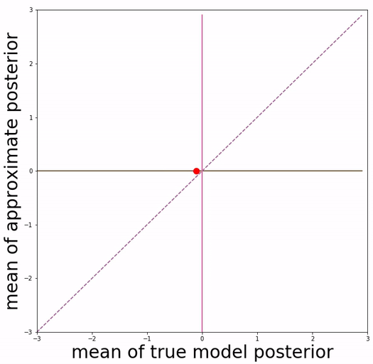
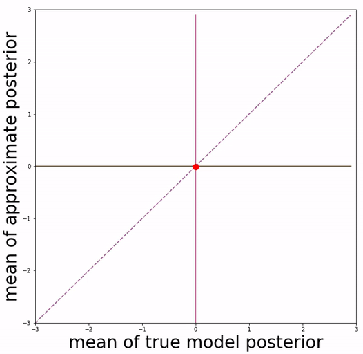
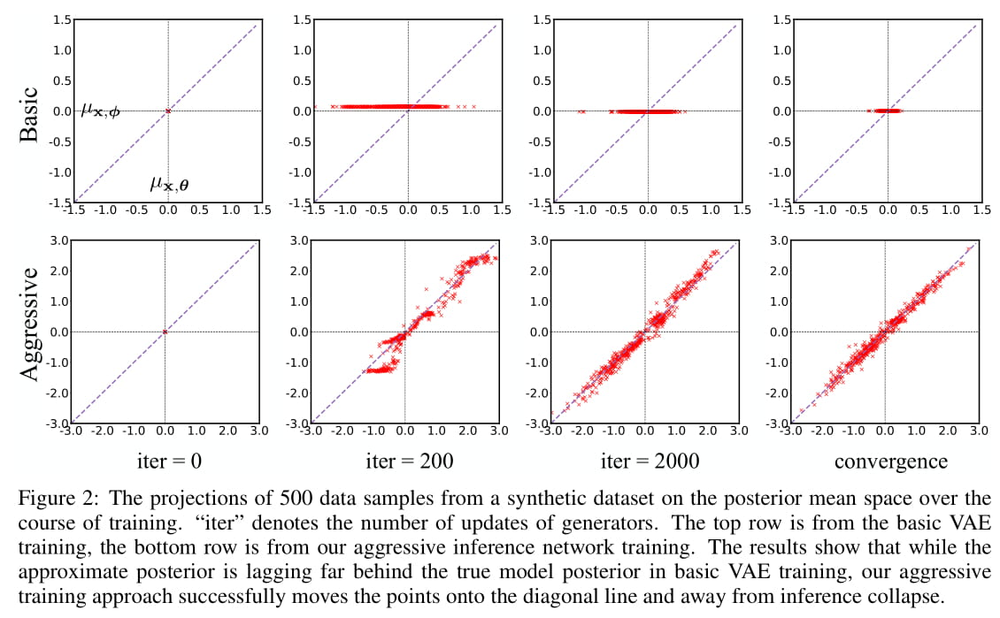

# Aggressive Training of Inference Network

This is PyTorch implementation of the [paper](http://arxiv.org/abs/1901.05534):

```
Lagging Inference Networks and Posterior Collapse in Variational Autoencoders
Junxian He, Daniel Spokoyny, Graham Neubig, Taylor Berg-Kirkpatrick
ICLR 2019
```

The code seperates optimization of encoder and decoder in VAE, and performs more steps of encoder update in each iteration. This new training procedure mitigates the issue of posterior collapse in VAE and leads to a better VAE model, without changing model components and training objective.

**This repo is able to reproduce quantitative experimental results and qualitative visualizations of posterior mean space presented in the paper.**

Please contact junxianh@cs.cmu.edu if you have any questions.





<br/><br/><br/><br/><br/><br/><br/><br/><br/><br/><br/><br/><br/><br/><br/><br/><br/>
&emsp;&emsp;&emsp;&emsp;&emsp;&emsp;&emsp;&emsp;&emsp;&emsp;**(a) basic VAE training** &emsp;&emsp;&emsp;&emsp;&emsp;&emsp;&emsp;&emsp;&emsp;&emsp;&emsp;&emsp;&emsp;&emsp;&emsp;&emsp;&emsp;&emsp;&emsp;**(b) Aggressive VAE training**

## Posterior Mean Space
Our approach is inspired by the definition of "posterior mean space", which helps observe the posterior status over course of training and analyze VAE training behavior from the perspective of training dynamics. In the paper we experimented with a toy dataset and a scalar latent variable, so that posterior mean space is on a 2-d plane.


## Requirements

* Python 3
* PyTorch 0.4

## Data

Datasets used in this paper can be downloaded with:

```
python prepare_data.py
```

By default it downloads all four datasets used in the paper, downloaded data is located in `./datasets/`. A `--dataset` option can be provided to specify the dataset name to be downloaded:
```
python prepare_data.py --dataset yahoo
```
The argument should be `synthetic`, `yahoo`, `yelp`, or `omniglot`. 


## Usage

Example script to train VAE on text data (training uses GPU when available):
```
python text.py --dataset yahoo --aggressive 1 --warm_up 10 --kl_start 0.1
```
image data:
```
python image.py --dataset omniglot --aggressive 1 --warm_up 10 --kl_start 0.1
```
Logs would be printed on standard output and also saved into folder `logs`.

Here:

* `--dataset` specifies the dataset name, currently it supports `synthetic`, `yahoo`, `yelp` for `text.py` and `omniglot` for `image.py`

* `--aggressive` controls whether applies aggressive training or not
* `--kl_start` represents starting KL weight (set to 1.0 to disable KL annealing)
* `--warm_up` represents number of annealing epochs (KL weight increases from `kl_start` to 1.0 linearly in the first `warm_up` epochs)

To run the code on your own text/image dataset, you need to create a new configuration file in `./config/` folder to specifiy network hyperparameters and datapath. If the new config file is `./config/config_abc.py`, then `--dataset` needs to be set as `abc` accordingly.

## Visualization of Posterior Mean Space
We project 500 data samples onto posterior mean space and observe the change over course of training.


To reproduce this visualization figure, first train the model on the toy dataset to save statistics required for visualization (training uses GPU when available):

```
python toy.py --aggressive 1 --plot_mode multiple
```

Here `--plot_mode` can be specified as `single` to reproduce the single-point trajectory figure (Figure 3 in the paper). This command trains a VAE model with aggressive training on synthetic data, and the required statistics is saved in folder `plot_data` (folder would be created automatically if non-existing).

Then run the plotting script:

```
python plot_scripts/plot_multiple.py --aggressive 1 --iter 2000
```

Here `--aggressive` specifies the aggressive training mode (should be the same as training), `--iter` specifies for which iteration the figure is plotted, we save the plotting data every 200 iterations by default at training time. The generated figures would be saved in folder `plot_figure` as pdf files (folder would be created automatically if non-existing).

Similarly, run `plot_single.py` is able to generate the single-point trajectory figure.

## Text Generation
Text generation is supported through sampling from either the prior or posterior (i.e. reconstruction). 

Generation from prior (by default it generates 100 samples):

```
python text.py --dataset [dataset] --decode_from [pretrained model path]
```

Reconstruction:

```
python text.py --dataset [dataset] --decode_from [pretrained model path] --decode_input [a text file for reconstruction]
```

``--decode_input`` file has one raw sentence per line, which is the same format as training data.

Optional `--decoding_strategy` argument can be used to specifiy decoding strategy as `{greedy, beam, sample}`. By default greedy decoding is performed. Generated sentences are saved in folder `samples`.


## Mutual Information and KL Curve

To plot the KL and mutual information curves over course of training (Figure 5 in the paper), first run:
```
python text.py --dataset yelp --aggressive 1 --warm_up 10 --kl_start 1.0
```

Then please refer to `plot_scripts/plot_log.ipynb` as an example to read the log file and generate plots.


## Reference

```
@inproceedings{he2018lagging,
title={Lagging Inference Networks and Posterior Collapse in Variational Autoencoders},
author={Junxian He and Daniel Spokoyny and Graham Neubig and Taylor Berg-Kirkpatrick},
booktitle={Proceedings of ICLR},
year={2019}
}
```


